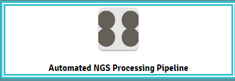

.. _astutorial:

Appsoma Website Tutorial
========================

This is a step by step tutorial for running the appsoma pipeline

.. important::
    We'll be moving away from appsoma. The general way of working with the apps should stay quite familiar however.

Contents
''''''''

* :ref:`Walkthrough <walkthrough>`
    * :ref:`Before GSAF Submission <step0>`
    * :ref:`Access the homepage <step1>`
    * :ref:`NGS Processing Pipeline <step2>`
        * :ref:`Grouping <step3>`
    * :ref:`(Step Four) <step4>`
    * :ref:`(Step Five) <step5>`

.. _walkthrough:

Walkthrough
'''''''''''

.. _step0:

**Before GSAF Submission**

.. note::
    Specific to GG Lab only

.. important::
    Before accessing NGS go the lab google docs folder and fill out the form describing your experiment metadata. Then contact Bing.
    Once you've done this your experiment will be stored in the database.

**Samples are Submitted to GSAF**

**Await GSAF results**

When GSAF completes you will receive an email containing this

.. image:: ASTutorialImages/Email.png
    :align: center
    :scale: 50%

.. note::
    The link in the image will be used in the :ref:`NGS automated pipeline <GSAF>`

:ref:`^To Top <astutorial>`

.. _step1:

**Homepage**

You'll first find yourself at the homepage. This will require you to log into Appsoma using your username and password.

.. image:: ASTutorialImages/AppSomaHomePage.png
    :align: center
    :alt: URL is htpps://appsoma.com/apps/IGrep+Homepage
    :target: https://appsoma.com/apps/IGrep+Homepage

Your first step will be to go to the "Automated NGS Processing Pipeline"

:ref:`^To Top <astutorial>`

.. _step2:

**NGS Processing Pipeline**

After choosing this option make sure you click "Start now".
Once finished loading you should arrive at this page

.. image:: ASTutorialImages/NGSPPinit.png
    :align: center
    :scale: 50%

.. _GSAF:

**If using GSAF**

paste your url into the box given

.. image:: ASTutorialImages/NGSPPlink1.png
    :align: center
    :scale: 75%

.. note::
    most people wil be using GSAF

**If from scratch**

1) select the folder where your experiment is
2) choose which files you'd like to use

.. image:: ASTutorialImages/NGSPP1.png
    :align: center
    :scale: 75%

:ref:`^To Top <astutorial>`

.. _step3:

**Grouping**

Next the files you selected will be grouped. You'll have the option to select the following options for the groups individually.

1) Stitches together pair end R1 and R2 files from MiSeq.
2) Quality Filter. Uses the Fastx ToolKit
3) Splits your sequences using a DNA barcode sequence.
4) Convert your FASTQ to FASTA

.. image:: ASTutorialImages/NGSPP2.png
    :align: center
    :scale: 75%

.. _step4:

.. _step5:
